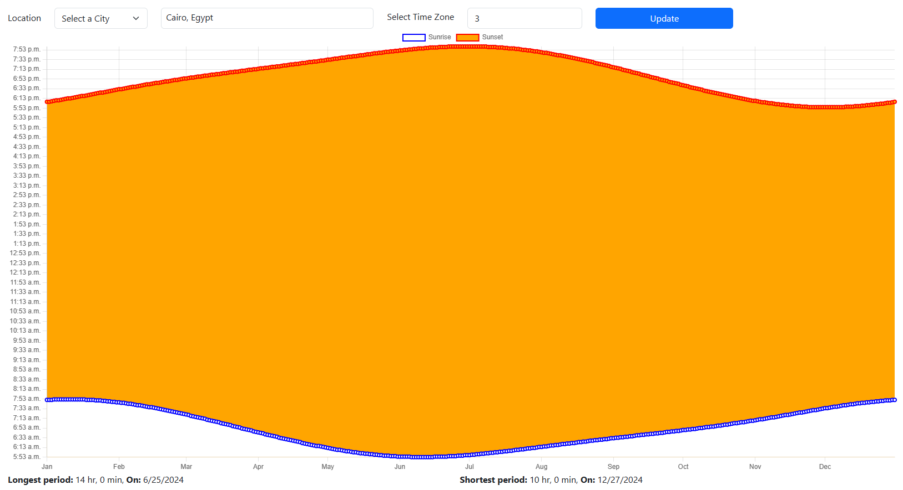

## Purpose

To display the day length (time between sunrise and sunset) for every day throughout a year for specific city.

## Usage

for demo:
https://hakim83.github.io/DaysPeriods/

To specify location you can select your current location (in which case you have to provide permission for browser location access), or select specific city by typing its name, you can also modify the related time zone in hours.
Hitting the *Update* button will show a graph for the current year days' values of sunrise and sunset, also at the page bottom the longest and the shortest period values and days.

## Development

Developed using Typescript and [SolidJs](https://www.solidjs.com/) framework, libraries used:
- [Adhan](https://github.com/batoulapps/adhan-js): used to calculate sunrise/sunset times.
- [chart.js](https://www.chartjs.org/) for graph drawing
- [solid-select](https://solid-select.com/) auto-complete input component for SolidJs
- [Bootstrap](https://getbootstrap.com/) for UI